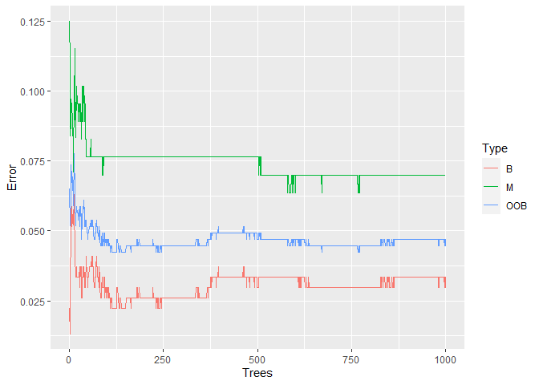
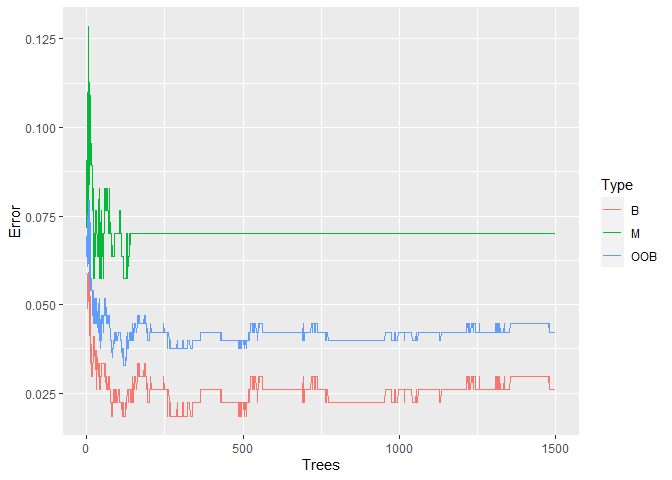
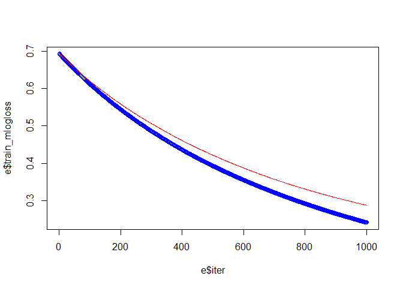
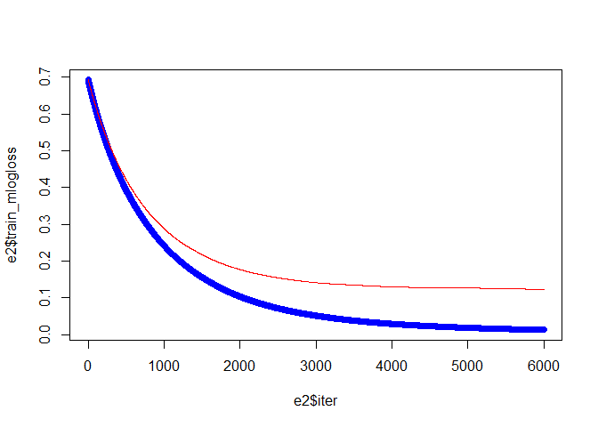
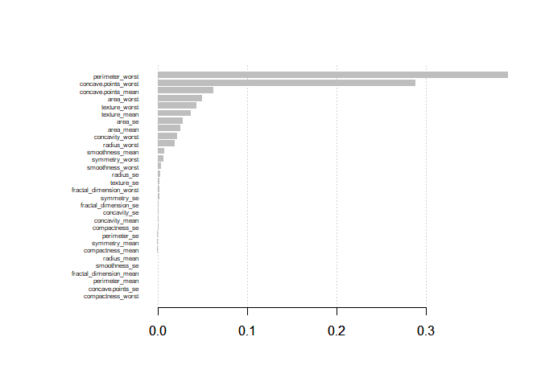
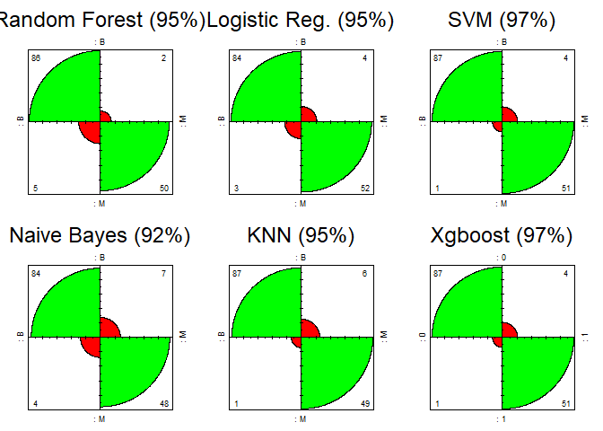

#### Las características se calculan a partir de una imagen digitalizada de un aspirado con aguja fina (FNA) de una masa mamaria. Describen las características de los núcleos celulares presentes en la imagen.  
#### n el espacio tridimensional es el descrito en:[K. P. Bennett and O. L. Mangasarian: "Robust Linear Programming Discrimination of Two Linearly Inseparable Sets", Optimization Methods and Software 1, 1992, 23-34].  
#### Esta base de datos también está disponible a través de UW CS ftp server:
ftp ftp.cs.wisc.edu
cd math-prog/cpo-dataset/machine-learn/WDBC/     
#### Como tambien UCI Machine Learning Repository: https://archive.ics.uci.edu/ml/datasets/Breast+Cancer+Wisconsin+%28Diagnostic%29

#### Columnas:

Diagnosis (variable dependiente) : M = Maligna, B = Benigna 

Se calculan diez características de valor real para cada núcleo celular:

a) radio (media de distancias desde el centro a puntos en el perímetro)
b) textura (desviación estándar de valores de escala de grises)
c) perímetro
d) área
e) suavidad (variación local en longitudes de radio)
f) compacidad (perímetro ^ 2 / área - 1.0)
g) concavidad (severidad de las porciones cóncavas del contorno)
h) puntos cóncavos (número de porciones cóncavas del contorno)
i) simetría
j) dimensión fractal ("aproximación de la costa" - 1)

La media, error estándar y "peor" o mayor (media de los tres
los valores más grandes) de estas características se calcularon para cada imagen,
resultando en 30 características. Por ejemplo, el campo 3 es Radio medio, campo
13 es el radio SE, el campo 23 es el peor radio.

Todos los valores de características se recodifican con cuatro dígitos significativos.


#### Cargamos el dataset y librerias a utilizar

```r
library(dplyr)
library(ggplot2)
library(purrr)
library(randomForest)
library(caret)
library(xgboost)
library(faraway)
options(warn = -1)

bc <- read.csv('data.csv')
#No necesito las columnas ID/X
bc <- bc[-c(1,33)]
```


#### Deteccion de outliers, o valores atipicos en nuestra data:


```r
(bc %>%
  select_if(is.numeric)%>%
  map(~boxplot.stats(.)$out))
```

```
## $radius_mean
##  [1] 25.22 22.27 24.25 23.27 27.22 23.29 28.11 23.21 23.51 25.73 22.01
## [12] 27.42 23.09 24.63
## 
## $texture_mean
## [1] 32.47 33.81 39.28 33.56 31.12 30.72 30.62
## 
## $perimeter_mean
##  [1] 171.5 152.8 166.2 152.1 182.1 158.9 188.5 153.5 155.1 174.2 186.9
## [12] 152.1 165.5
## 
## $area_mean
##  [1] 1404 1878 1509 1761 1686 2250 1685 2499 1670 1364 1419 1491 1747 2010
## [15] 1546 1482 1386 1335 1407 1384 2501 1682 1841 1347 1479
## 
## $smoothness_mean
## [1] 0.14250 0.13980 0.14470 0.16340 0.13710 0.05263
## 
## $compactness_mean
##  [1] 0.2776 0.2839 0.2396 0.2458 0.2293 0.3454 0.2665 0.2768 0.2867 0.2832
## [11] 0.2413 0.3114 0.2364 0.2363 0.2576 0.2770
## 
## $concavity_mean
##  [1] 0.3001 0.3130 0.3754 0.3339 0.4264 0.3003 0.4268 0.4108 0.2871 0.3523
## [11] 0.3201 0.3176 0.2914 0.3368 0.3189 0.3635 0.3174 0.3514
## 
## $concave.points_mean
##  [1] 0.1604 0.1845 0.1823 0.2012 0.1878 0.1620 0.1595 0.1913 0.1562 0.1689
## 
## $symmetry_mean
##  [1] 0.2597 0.2521 0.3040 0.2743 0.2906 0.2556 0.2655 0.2678 0.2540 0.2548
## [11] 0.2495 0.2595 0.2569 0.2538 0.1060
## 
## $fractal_dimension_mean
##  [1] 0.09744 0.08243 0.08046 0.08980 0.08142 0.08261 0.09296 0.08116
##  [9] 0.08104 0.08743 0.08450 0.07950 0.09502 0.09575 0.07976
## 
## $radius_se
##  [1] 1.0950 0.9555 1.0460 0.8529 1.2140 0.9811 0.9806 0.9317 0.8973 1.2150
## [11] 1.5090 1.2960 1.0000 1.0880 0.8601 2.8730 0.9553 1.0580 1.0040 1.2920
## [21] 1.1720 1.1670 0.8811 1.1110 1.0720 1.0090 0.9948 0.9761 1.2070 1.0080
## [31] 1.3700 0.9291 2.5470 0.9289 1.2910 0.9915 0.9622 1.1760
## 
## $texture_se
##  [1] 3.568 2.910 3.120 2.508 2.664 4.885 2.612 2.454 2.777 2.509 2.836
## [12] 2.878 2.542 2.643 3.647 2.635 2.927 2.904 3.896 2.463
## 
## $perimeter_se
##  [1]  8.589 11.070  7.276  8.077  8.830  6.311  8.649  7.382 10.050  9.807
## [11]  8.419  6.971  7.337  7.029 21.980  6.487  7.247  6.372  7.158 10.120
## [21]  6.146  7.749  8.867  7.237  7.804  6.076  6.462  7.222  7.128  7.733
## [31]  7.561  9.424  6.051 18.650  9.635  7.050  8.758  7.673
## 
## $area_se
##  [1] 153.40  94.03  94.44 116.20 112.40  93.99 102.60 111.40  93.54 105.00
## [11] 106.00 104.90  98.81 102.50  96.05 134.80 116.40 120.00  87.87 170.00
## [21]  90.47 233.00 101.90  93.91 119.30  97.07  97.85 122.30 128.70 111.70
## [31] 525.60 124.40 109.90 155.80 137.90  92.81 106.40 138.50  90.94 199.70
## [41] 156.80 133.00 130.80  87.17  88.25 164.10 153.10 103.60 224.10 130.20
## [51] 176.50 103.90 115.20 542.20 104.90  89.74  95.77 180.20 139.90 100.40
## [61]  87.78 118.80 158.70  99.04  86.22
## 
## $smoothness_se
##  [1] 0.01721 0.01340 0.01385 0.01291 0.01835 0.02333 0.01496 0.01286
##  [9] 0.01439 0.01380 0.01345 0.03113 0.01604 0.01380 0.01418 0.01574
## [17] 0.02075 0.01289 0.01736 0.01582 0.01474 0.01307 0.01459 0.02177
## [25] 0.01262 0.01546 0.01288 0.01266 0.01547 0.01291
## 
## $compactness_se
##  [1] 0.07458 0.07217 0.08297 0.10060 0.07056 0.08606 0.09368 0.06835
##  [9] 0.08668 0.07446 0.06760 0.09806 0.09586 0.08808 0.13540 0.08555
## [17] 0.08262 0.10640 0.06590 0.06559 0.07643 0.06669 0.06213 0.06657
## [25] 0.07025 0.07471 0.06457 0.06158
## 
## $concavity_se
##  [1] 0.08890 0.09723 0.30380 0.10910 0.10400 0.14350 0.09263 0.12780
##  [9] 0.39600 0.11970 0.11660 0.08958 0.14380 0.08880 0.09518 0.09960
## [17] 0.10270 0.09953 0.15350 0.09472 0.11140 0.09252
## 
## $concave.points_se
##  [1] 0.04090 0.02638 0.03322 0.02593 0.02801 0.05279 0.02794 0.02765
##  [9] 0.03927 0.03024 0.03487 0.02771 0.02536 0.02919 0.03441 0.02598
## [17] 0.02721 0.02853 0.02624
## 
## $symmetry_se
##  [1] 0.05963 0.04484 0.03672 0.05333 0.04183 0.04192 0.04197 0.07895
##  [9] 0.05014 0.04547 0.05168 0.05628 0.03880 0.05113 0.03799 0.04783
## [17] 0.04499 0.04077 0.06146 0.04022 0.04243 0.03756 0.03675 0.05543
## [25] 0.03710 0.03997 0.03759
## 
## $fractal_dimension_se
##  [1] 0.009208 0.010080 0.012840 0.008093 0.009559 0.021930 0.010390
##  [8] 0.012980 0.009875 0.009423 0.009368 0.011780 0.029840 0.017920
## [15] 0.011720 0.012560 0.008675 0.008660 0.022860 0.012200 0.012330
## [22] 0.008925 0.008133 0.011300 0.009627 0.010450 0.011480 0.008313
## 
## $radius_worst
##  [1] 29.17 30.00 28.40 28.01 33.12 28.11 27.90 31.01 32.49 28.19 30.67
## [12] 33.13 30.75 27.66 36.04 30.79 29.92
## 
## $texture_worst
## [1] 45.41 44.87 49.54 47.16 42.79
## 
## $perimeter_worst
##  [1] 188.0 211.7 206.8 220.8 188.5 206.0 214.0 195.9 202.4 229.3 199.5
## [12] 195.0 251.2 211.5 205.7
## 
## $area_worst
##  [1] 2019 1956 2398 2615 2215 2145 2562 2360 2073 2232 2403 3216 2089 1986
## [15] 2499 2009 2477 2944 2010 1972 3432 2384 2053 1938 2906 3234 3143 2227
## [29] 1946 2081 2022 4254 2782 2642 2027
## 
## $smoothness_worst
## [1] 0.20980 0.19090 0.07117 0.22260 0.21840 0.19020 0.20060
## 
## $compactness_worst
##  [1] 0.6656 0.8663 1.0580 0.7725 0.6577 0.6643 0.6590 0.7444 0.7394 0.6997
## [11] 0.7584 0.9327 0.9379 0.7090 0.7917 0.8681
## 
## $concavity_worst
##  [1] 1.1050 1.2520 0.9608 0.8216 0.8488 0.7892 0.8489 0.8402 0.9034 0.9019
## [11] 1.1700 0.9387
## 
## $concave.points_worst
## numeric(0)
## 
## $symmetry_worst
##  [1] 0.4601 0.6638 0.4378 0.4366 0.4218 0.4667 0.4264 0.4761 0.4270 0.4863
## [11] 0.4670 0.4228 0.5440 0.4882 0.5774 0.5166 0.4753 0.4432 0.4724 0.5558
## [21] 0.4245 0.4824 0.4677
## 
## $fractal_dimension_worst
##  [1] 0.1730 0.1244 0.2075 0.1431 0.1341 0.1275 0.1402 0.1233 0.1339 0.1405
## [11] 0.1252 0.1486 0.1259 0.1284 0.1446 0.1243 0.1297 0.1297 0.1403 0.1249
## [21] 0.1252 0.1364 0.1409 0.1240
```

```r
summary(bc$area_se)
```

```
##    Min. 1st Qu.  Median    Mean 3rd Qu.    Max. 
##   6.802  17.850  24.530  40.337  45.190 542.200
```

#### Son muchos los outliers, y parecen ser de caracter importante para el estudio. No los modificaré ni quitare por ahora.

#### imputando valores NA


```r
sapply(bc,function(x) sum(is.na(x)))
```

```
##               diagnosis             radius_mean            texture_mean 
##                       0                       0                       0 
##          perimeter_mean               area_mean         smoothness_mean 
##                       0                       0                       0 
##        compactness_mean          concavity_mean     concave.points_mean 
##                       0                       0                       0 
##           symmetry_mean  fractal_dimension_mean               radius_se 
##                       0                       0                       0 
##              texture_se            perimeter_se                 area_se 
##                       0                       0                       0 
##           smoothness_se          compactness_se            concavity_se 
##                       0                       0                       0 
##       concave.points_se             symmetry_se    fractal_dimension_se 
##                       0                       0                       0 
##            radius_worst           texture_worst         perimeter_worst 
##                       0                       0                       0 
##              area_worst        smoothness_worst       compactness_worst 
##                       0                       0                       0 
##         concavity_worst    concave.points_worst          symmetry_worst 
##                       0                       0                       0 
## fractal_dimension_worst 
##                       0
```

#### No hay valores NA, ningun dato faltante

#### Comencemos entonces con adaptar el mejor modelo a la data presente, para poder predecir si un tumor presente sea maligno o benigno. Dividiremos toda nuestra data en dos partes, una para entrenar (train set) nuestro modelo, y el otro para probarlo.


```r
set.seed(999)
train_index <- sample(1:nrow(bc),nrow(bc) * 0.75)

bc_train <- bc[train_index,]
bc_test <- bc[-train_index,]
```

## Empecemos con el algoritmo de Random Forest, adaptemos la data a nuestro primer modelo de clasificacion:


```r
rf_500 <- randomForest(diagnosis~.,data = bc_train, ntree= 500)

rf_500
```

```
## 
## Call:
##  randomForest(formula = diagnosis ~ ., data = bc_train, ntree = 500) 
##                Type of random forest: classification
##                      Number of trees: 500
## No. of variables tried at each split: 5
## 
##         OOB estimate of  error rate: 4.23%
## Confusion matrix:
##     B   M class.error
## B 261   8  0.02973978
## M  10 147  0.06369427
```

#### Con 500 arboles, nuestro OOB (Out of bag error) es de 4.23%. Este OOB es como un set de validacion dentro del algoritmo de Random Forest, y por ende no es necesario probarlo con cross validation.

#### Mejorará el modelo con 500 arboles mas?


```r
rf_1000 <- randomForest(diagnosis~.,data = bc_train, ntree= 1000)

rf_1000
```

```
## 
## Call:
##  randomForest(formula = diagnosis ~ ., data = bc_train, ntree = 1000) 
##                Type of random forest: classification
##                      Number of trees: 1000
## No. of variables tried at each split: 5
## 
##         OOB estimate of  error rate: 4.69%
## Confusion matrix:
##     B   M class.error
## B 260   9  0.03345725
## M  11 146  0.07006369
```

#### Con 1000 arboles, el error aumenta un poco, 4.69%. Observemos en un grafico para ver si es tendencia el aumento de error con mas arboles


```r
rf_1000_oob <- data.frame(
  Trees = rep(1:nrow(rf_1000$err.rate),times=3),
  Type = rep(c('OOB','B','M'),each = nrow(rf_1000$err.rate)),
  Error = c(rf_1000$err.rate[,'OOB'],
            rf_1000$err.rate[,'B'],
            rf_1000$err.rate[,'M']))

ggplot(rf_1000_oob,aes(x = Trees, y = Error))+
  geom_line(aes(col=Type))
```

<!-- -->

#### En los arboles aproximados al numero mil, vemos que baja el error. Probemos una ultima vez pero con 1500 arboles para ver si baja el error.


```r
rf_1500 <- randomForest(diagnosis~.,data = bc_train,ntree = 1500)

rf_1500
```

```
## 
## Call:
##  randomForest(formula = diagnosis ~ ., data = bc_train, ntree = 1500) 
##                Type of random forest: classification
##                      Number of trees: 1500
## No. of variables tried at each split: 5
## 
##         OOB estimate of  error rate: 4.23%
## Confusion matrix:
##     B   M class.error
## B 262   7  0.02602230
## M  11 146  0.07006369
```

```r
rf_1500_oob <- data.frame(
  Trees = rep(1:nrow(rf_1500$err.rate),times=3),
  Type = rep(c('OOB','B','M'),each = nrow(rf_1500$err.rate)),
  Error = c(rf_1500$err.rate[,'OOB'],
            rf_1500$err.rate[,'B'],
            rf_1500$err.rate[,'M']))

ggplot(rf_1500_oob,aes(x = Trees, y = Error))+
  geom_line(aes(col=Type))
```

<!-- -->


#### 1500 arboles termino en el mismo resultado que 500 arboles (el valor default del algoritmo), entonces procederemos a fijar este parametro en 500 arboles.

#### Ahora sigamos con la busqueda del mejor valor del parametro 'mtry', que es el numero de variables al azar como candidatas en cada división (split). 


```r
rf_vars <- c()

for(i in 1:(ncol(bc_train) - 1)){
  
  temp_model <- randomForest(diagnosis~.,data=bc_train,mtry = i)
  rf_vars[i] <- temp_model$err.rate[nrow(temp_model$err.rate),1]
  
  
}

rf_vars
```

```
##  [1] 0.04225352 0.03755869 0.04225352 0.03990610 0.03755869 0.04225352
##  [7] 0.03755869 0.04460094 0.03521127 0.03755869 0.04225352 0.04225352
## [13] 0.04225352 0.03990610 0.04225352 0.04225352 0.04225352 0.04460094
## [19] 0.04694836 0.04694836 0.04694836 0.04460094 0.04460094 0.04460094
## [25] 0.04694836 0.04460094 0.03990610 0.04694836 0.04694836 0.04929577
```


##### Los mejores splits = 2,5,7,9. Recreamos los modelos con el mejor numero de arboles (500 por default) y los mejores splits y elegimos el mejor:


```r
rf_mtry2 <- randomForest(diagnosis~.,data = bc_train,mtry = 2)
rf_mtry5 <- randomForest(diagnosis~.,data = bc_train,mtry = 5)
rf_mtry7 <- randomForest(diagnosis~.,data = bc_train,mtry = 7)
rf_mtry9 <- randomForest(diagnosis~.,data = bc_train,mtry = 9)

rf_mtry2
```

```
## 
## Call:
##  randomForest(formula = diagnosis ~ ., data = bc_train, mtry = 2) 
##                Type of random forest: classification
##                      Number of trees: 500
## No. of variables tried at each split: 2
## 
##         OOB estimate of  error rate: 3.99%
## Confusion matrix:
##     B   M class.error
## B 263   6  0.02230483
## M  11 146  0.07006369
```

```r
#oob.error : 3.99%

rf_mtry5
```

```
## 
## Call:
##  randomForest(formula = diagnosis ~ ., data = bc_train, mtry = 5) 
##                Type of random forest: classification
##                      Number of trees: 500
## No. of variables tried at each split: 5
## 
##         OOB estimate of  error rate: 4.23%
## Confusion matrix:
##     B   M class.error
## B 262   7  0.02602230
## M  11 146  0.07006369
```

```r
#oob.error: 4.23%

rf_mtry7
```

```
## 
## Call:
##  randomForest(formula = diagnosis ~ ., data = bc_train, mtry = 7) 
##                Type of random forest: classification
##                      Number of trees: 500
## No. of variables tried at each split: 7
## 
##         OOB estimate of  error rate: 4.23%
## Confusion matrix:
##     B   M class.error
## B 262   7  0.02602230
## M  11 146  0.07006369
```

```r
#oob.error 4.23%

rf_mtry9
```

```
## 
## Call:
##  randomForest(formula = diagnosis ~ ., data = bc_train, mtry = 9) 
##                Type of random forest: classification
##                      Number of trees: 500
## No. of variables tried at each split: 9
## 
##         OOB estimate of  error rate: 3.99%
## Confusion matrix:
##     B   M class.error
## B 261   8  0.02973978
## M   9 148  0.05732484
```

```r
#oob.error 3.99%

rf_best <- rf_mtry9
```

#### rf_mtry 2 y rf_mtry9 son los mejores modelo, usaremos __rf_mtry9__(renombrado rf_best), el mejor modelo con este algoritmo.


```r
bc_test$rf <- predict(rf_best,newdata=bc_test)

#confusion matrix para estudiar exactitud de las predicciones

rf_acc <- (sum(diag(table(bc_test$diagnosis,bc_test$rf)))/nrow(bc_test))

rf_acc_plot <- confusionMatrix(table(bc_test$diagnosis,bc_test$rf))

#95.10% acc
```

##### Accuracy del modelo Random Forest: 95%


## LOGISTIC REGRESSION

#### Probemos ahora con otro algoritmo: Regresion logistica.  

#### El primer modelo lo haremos con todas las variables para ver cuales son significantes.  

#### Utilizando el paquete de caret, uso CV para combatir overfitting, y aumentar la exactitud.


```r
glm_model <- glm(diagnosis~.,data = bc_train,
                  family = 'binomial')

summary(glm_model)

control <- trainControl(method = 'cv', number = 10)

logit_all <- train(diagnosis~.,data = bc_train,
                   method = 'glm', family = 'binomial', 
                   trControl = control)
```


#### Todas las variables resultaron ser significante!


```r
bc_test$logit <- predict(logit_all,newdata=bc_test)

#confusion matrix

logit_acc <- sum(diag(table(bc_test$diagnosis,bc_test$logit)))/nrow(bc_test)

logit_acc_plot <- confusionMatrix(table(bc_test$diagnosis,bc_test$logit))

logit_acc
```

```
## [1] 0.951049
```


##### Accuracy del modelo con regresion logistica: 95%, a la par con random forest!

##### Por las dudas, probemos que no haya multicolinearidad:


```r
vif(glm_model)
```

```
##             radius_mean            texture_mean          perimeter_mean 
##            1.091374e+15            5.753463e+11            1.260607e+15 
##               area_mean         smoothness_mean        compactness_mean 
##            1.730263e+13            7.509994e+11            1.115115e+13 
##          concavity_mean     concave.points_mean           symmetry_mean 
##            5.469933e+12            1.858740e+12            1.238924e+12 
##  fractal_dimension_mean               radius_se              texture_se 
##            1.067059e+12            7.847487e+12            1.546427e+11 
##            perimeter_se                 area_se           smoothness_se 
##            7.892537e+12            2.805565e+12            9.770092e+11 
##          compactness_se            concavity_se       concave.points_se 
##            4.072882e+12            1.623036e+12            5.399525e+11 
##             symmetry_se    fractal_dimension_se            radius_worst 
##            3.783874e+11            2.065382e+12            1.093207e+14 
##           texture_worst         perimeter_worst              area_worst 
##            6.650123e+11            1.490495e+14            2.693001e+13 
##        smoothness_worst       compactness_worst         concavity_worst 
##            8.059249e+11            2.497848e+12            1.318171e+12 
##    concave.points_worst          symmetry_worst fractal_dimension_worst 
##            2.282789e+12            1.080463e+12            1.140456e+12
```

```r
#No existe evidencia para concluir que existe multicolinearidad
```


## SUPPORT VECTOR MACHINE, 3 variaciones:

##### SVM linear:


```r
cost_svm <- expand.grid(C= 2^(-1:6))
#Parametro de costo, es un penal por classificar mal.


svm_linear <- train(diagnosis ~., data = bc_train, method = "svmLinear", 
              trControl = control,  preProcess = c("center","scale"), 
              tuneGrid = cost_svm)

#es importante llevar a escala el data frame para ejecutra este algoritmo, por ende
#se agrega el parametro preprocess. 

svm_linear
```

```
## Support Vector Machines with Linear Kernel 
## 
## 426 samples
##  30 predictor
##   2 classes: 'B', 'M' 
## 
## Pre-processing: centered (30), scaled (30) 
## Resampling: Cross-Validated (10 fold) 
## Summary of sample sizes: 383, 384, 384, 383, 383, 384, ... 
## Resampling results across tuning parameters:
## 
##   C     Accuracy   Kappa    
##    0.5  0.9789037  0.9542398
##    1.0  0.9765781  0.9495743
##    2.0  0.9696013  0.9341841
##    4.0  0.9555925  0.9040065
##    8.0  0.9602436  0.9140520
##   16.0  0.9532669  0.9001456
##   32.0  0.9508306  0.8949946
##   64.0  0.9485050  0.8901559
## 
## Accuracy was used to select the optimal model using the largest value.
## The final value used for the model was C = 0.5.
```

```r
#mejor exactitud lograda con Costo = 0.5. 
#0.9789037 Acc
```

##### Mejor exactitud lograda con Costo = 0.5.   
##### 0.9789037 Accuracy

#### Pero miremos si podemos mejorar aun mas el modelo seleccionando un c entre 0 y 1, dado el mejor C (costo) anterior.


```r
cost_svm_01 <- expand.grid(C = seq(0.1,1,length = 20))

svm_linear_2 <- train(diagnosis ~., data = bc_train, method = "svmLinear", 
                    trControl = control,  preProcess = c("center","scale"), 
                    tuneGrid = cost_svm_01)

svm_linear_2
```

```
## Support Vector Machines with Linear Kernel 
## 
## 426 samples
##  30 predictor
##   2 classes: 'B', 'M' 
## 
## Pre-processing: centered (30), scaled (30) 
## Resampling: Cross-Validated (10 fold) 
## Summary of sample sizes: 383, 383, 383, 383, 384, 384, ... 
## Resampling results across tuning parameters:
## 
##   C          Accuracy   Kappa    
##   0.1000000  0.9812292  0.9589950
##   0.1473684  0.9788483  0.9541439
##   0.1947368  0.9787929  0.9538229
##   0.2421053  0.9787929  0.9538229
##   0.2894737  0.9741417  0.9438676
##   0.3368421  0.9741971  0.9443107
##   0.3842105  0.9742525  0.9442474
##   0.4315789  0.9742525  0.9441270
##   0.4789474  0.9742525  0.9441270
##   0.5263158  0.9719269  0.9388173
##   0.5736842  0.9718715  0.9381379
##   0.6210526  0.9718715  0.9381379
##   0.6684211  0.9718715  0.9381379
##   0.7157895  0.9718715  0.9381379
##   0.7631579  0.9718715  0.9381379
##   0.8105263  0.9718715  0.9381379
##   0.8578947  0.9718715  0.9381379
##   0.9052632  0.9718715  0.9385349
##   0.9526316  0.9718715  0.9385349
##   1.0000000  0.9695460  0.9333655
## 
## Accuracy was used to select the optimal model using the largest value.
## The final value used for the model was C = 0.1.
```

##### El modelo mejoro!  
##### 0.9812292 acc, con C = 0.1  


####SVM RADIAL:


```r
svm_radial <- train(diagnosis ~., data = bc_train, method = "svmRadial", 
                      trControl = control,  preProcess = c("center","scale"), 
                      tuneLength = 10)
#tunelenght devuelve el mejor parametro de costo y sigma!!

svm_radial
```

```
## Support Vector Machines with Radial Basis Function Kernel 
## 
## 426 samples
##  30 predictor
##   2 classes: 'B', 'M' 
## 
## Pre-processing: centered (30), scaled (30) 
## Resampling: Cross-Validated (10 fold) 
## Summary of sample sizes: 383, 383, 384, 383, 383, 384, ... 
## Resampling results across tuning parameters:
## 
##   C       Accuracy   Kappa    
##     0.25  0.9554264  0.9031388
##     0.50  0.9577519  0.9086817
##     1.00  0.9696567  0.9333676
##     2.00  0.9766334  0.9494428
##     4.00  0.9789590  0.9543571
##     8.00  0.9766888  0.9495163
##    16.00  0.9719823  0.9398722
##    32.00  0.9648948  0.9247607
##    64.00  0.9648948  0.9247607
##   128.00  0.9648948  0.9247607
## 
## Tuning parameter 'sigma' was held constant at a value of 0.04189731
## Accuracy was used to select the optimal model using the largest value.
## The final values used for the model were sigma = 0.04189731 and C = 4.
```

##### 0.9789590 accuracy, un poco peor que el mejor modelo de SVM lineal


#### SVM polinomial:


```r
svm_poli <- train(diagnosis ~., data = bc_train, method = "svmPoly", 
                    trControl = control,  preProcess = c("center","scale"), 
                    tuneLength = 10)

svm_poli
```

```
## Support Vector Machines with Polynomial Kernel 
## 
## 426 samples
##  30 predictor
##   2 classes: 'B', 'M' 
## 
## Pre-processing: centered (30), scaled (30) 
## Resampling: Cross-Validated (10 fold) 
## Summary of sample sizes: 384, 383, 383, 383, 383, 384, ... 
## Resampling results across tuning parameters:
## 
##   degree  scale  C       Accuracy   Kappa    
##   1       1e-03    0.25  0.8097210  0.5382125
##   1       1e-03    0.50  0.9035275  0.7787037
##   1       1e-03    1.00  0.9389731  0.8639455
##   1       1e-03    2.00  0.9483308  0.8848980
##   1       1e-03    4.00  0.9506563  0.8904984
##   1       1e-03    8.00  0.9648921  0.9225748
##   1       1e-03   16.00  0.9694852  0.9328448
##   1       1e-03   32.00  0.9671596  0.9282008
##   1       1e-03   64.00  0.9812819  0.9595062
##   1       1e-03  128.00  0.9883721  0.9746631
##   1       1e-02    0.25  0.9483308  0.8848980
##   1       1e-02    0.50  0.9576885  0.9062678
##   1       1e-02    1.00  0.9695986  0.9334218
##   1       1e-02    2.00  0.9694852  0.9331049
##   1       1e-02    4.00  0.9719796  0.9389503
##   1       1e-02    8.00  0.9859331  0.9695916
##   1       1e-02   16.00  0.9837209  0.9647128
##   1       1e-02   32.00  0.9744186  0.9445337
##   1       1e-02   64.00  0.9697674  0.9348225
##   1       1e-02  128.00  0.9744186  0.9442819
##   1       1e-01    0.25  0.9671596  0.9282008
##   1       1e-01    0.50  0.9812819  0.9595062
##   1       1e-01    1.00  0.9860465  0.9693534
##   1       1e-01    2.00  0.9790698  0.9547557
##   1       1e-01    4.00  0.9767442  0.9494378
##   1       1e-01    8.00  0.9697674  0.9348225
##   1       1e-01   16.00  0.9720930  0.9391091
##   1       1e-01   32.00  0.9626219  0.9190577
##   1       1e-01   64.00  0.9579153  0.9090412
##   1       1e-01  128.00  0.9673865  0.9295637
##   1       1e+00    0.25  0.9813953  0.9592766
##   1       1e+00    0.50  0.9767442  0.9494378
##   1       1e+00    1.00  0.9697674  0.9348225
##   1       1e+00    2.00  0.9673284  0.9284678
##   1       1e+00    4.00  0.9602409  0.9139505
##   1       1e+00    8.00  0.9648921  0.9241659
##   1       1e+00   16.00  0.9697121  0.9343559
##   1       1e+00   32.00  0.9650609  0.9242739
##   1       1e+00   64.00  0.9579153  0.9087924
##   1       1e+00  128.00  0.9531507  0.8986922
##   1       1e+01    0.25  0.9649475  0.9233298
##   1       1e+01    0.50  0.9579153  0.9090412
##   1       1e+01    1.00  0.9625665  0.9191248
##   1       1e+01    2.00  0.9720377  0.9391402
##   1       1e+01    4.00  0.9627353  0.9194816
##   1       1e+01    8.00  0.9554763  0.9037316
##   1       1e+01   16.00  0.9531507  0.8986922
##   1       1e+01   32.00  0.9531507  0.8986922
##   1       1e+01   64.00  0.9531507  0.8986922
##   1       1e+01  128.00  0.9531507  0.8986922
##   1       1e+02    0.25  0.9720377  0.9391402
##   1       1e+02    0.50  0.9579707  0.9091073
##   1       1e+02    1.00  0.9531507  0.8986922
##   1       1e+02    2.00  0.9531507  0.8986922
##   1       1e+02    4.00  0.9531507  0.8986922
##   1       1e+02    8.00  0.9531507  0.8986922
##   1       1e+02   16.00  0.9531507  0.8986922
##   1       1e+02   32.00  0.9531507  0.8986922
##   1       1e+02   64.00  0.9531507  0.8986922
##   1       1e+02  128.00  0.9531507  0.8986922
##   1       1e+03    0.25  0.9531507  0.8986922
##   1       1e+03    0.50  0.9531507  0.8986922
##   1       1e+03    1.00  0.9531507  0.8986922
##   1       1e+03    2.00  0.9531507  0.8986922
##   1       1e+03    4.00  0.9531507  0.8986922
##   1       1e+03    8.00  0.9531507  0.8986922
##   1       1e+03   16.00  0.9531507  0.8986922
##   1       1e+03   32.00  0.9531507  0.8986922
##   1       1e+03   64.00  0.9531507  0.8986922
##   1       1e+03  128.00  0.9531507  0.8986922
##   1       1e+04    0.25  0.9531507  0.8986922
##   1       1e+04    0.50  0.9531507  0.8986922
##   1       1e+04    1.00  0.9531507  0.8986922
##   1       1e+04    2.00  0.9531507  0.8986922
##   1       1e+04    4.00  0.9531507  0.8986922
##   1       1e+04    8.00  0.9531507  0.8986922
##   1       1e+04   16.00  0.9531507  0.8986922
##   1       1e+04   32.00  0.9531507  0.8986922
##   1       1e+04   64.00  0.9531507  0.8986922
##   1       1e+04  128.00  0.9531507  0.8986922
##   1       1e+05    0.25  0.9531507  0.8986922
##   1       1e+05    0.50  0.9531507  0.8986922
##   1       1e+05    1.00  0.9531507  0.8986922
##   1       1e+05    2.00  0.9531507  0.8986922
##   1       1e+05    4.00  0.9531507  0.8986922
##   1       1e+05    8.00  0.9531507  0.8986922
##   1       1e+05   16.00  0.9531507  0.8986922
##   1       1e+05   32.00  0.9531507  0.8986922
##   1       1e+05   64.00  0.9531507  0.8986922
##   1       1e+05  128.00  0.9531507  0.8986922
##   1       1e+06    0.25  0.9531507  0.8986922
##   1       1e+06    0.50  0.9531507  0.8986922
##   1       1e+06    1.00  0.9531507  0.8986922
##   1       1e+06    2.00  0.9531507  0.8986922
##   1       1e+06    4.00  0.9531507  0.8986922
##   1       1e+06    8.00  0.9531507  0.8986922
##   1       1e+06   16.00  0.9531507  0.8986922
##   1       1e+06   32.00  0.9531507  0.8986922
##   1       1e+06   64.00  0.9531507  0.8986922
##   1       1e+06  128.00  0.9531507  0.8986922
##   2       1e-03    0.25  0.9035275  0.7787037
##   2       1e-03    0.50  0.9412987  0.8688548
##   2       1e-03    1.00  0.9483308  0.8848980
##   2       1e-03    2.00  0.9506563  0.8904984
##   2       1e-03    4.00  0.9648921  0.9225748
##   2       1e-03    8.00  0.9671596  0.9279355
##   2       1e-03   16.00  0.9694852  0.9332418
##   2       1e-03   32.00  0.9812819  0.9595062
##   2       1e-03   64.00  0.9883721  0.9746631
##   2       1e-03  128.00  0.9837209  0.9645811
##   2       1e-02    0.25  0.9529819  0.8956712
##   2       1e-02    0.50  0.9719242  0.9383311
##   2       1e-02    1.00  0.9694852  0.9331049
##   2       1e-02    2.00  0.9764619  0.9484966
##   2       1e-02    4.00  0.9859331  0.9695916
##   2       1e-02    8.00  0.9836075  0.9644189
##   2       1e-02   16.00  0.9812819  0.9593762
##   2       1e-02   32.00  0.9788429  0.9537582
##   2       1e-02   64.00  0.9694852  0.9332203
##   2       1e-02  128.00  0.9601829  0.9138318
##   2       1e-01    0.25  0.9788429  0.9541434
##   2       1e-01    0.50  0.9742498  0.9444015
##   2       1e-01    1.00  0.9695406  0.9342263
##   2       1e-01    2.00  0.9672150  0.9294421
##   2       1e-01    4.00  0.9577992  0.9087337
##   2       1e-01    8.00  0.9577465  0.9089773
##   2       1e-01   16.00  0.9577465  0.9089773
##   2       1e-01   32.00  0.9577465  0.9089773
##   2       1e-01   64.00  0.9577465  0.9089773
##   2       1e-01  128.00  0.9577465  0.9089773
##   2       1e+00    0.25  0.9554763  0.9028876
##   2       1e+00    0.50  0.9554763  0.9028876
##   2       1e+00    1.00  0.9554763  0.9028876
##   2       1e+00    2.00  0.9554763  0.9028876
##   2       1e+00    4.00  0.9554763  0.9028876
##   2       1e+00    8.00  0.9554763  0.9028876
##   2       1e+00   16.00  0.9554763  0.9028876
##   2       1e+00   32.00  0.9554763  0.9028876
##   2       1e+00   64.00  0.9554763  0.9028876
##   2       1e+00  128.00  0.9554763  0.9028876
##   2       1e+01    0.25  0.9342112  0.8553062
##   2       1e+01    0.50  0.9342112  0.8553062
##   2       1e+01    1.00  0.9342112  0.8553062
##   2       1e+01    2.00  0.9342112  0.8553062
##   2       1e+01    4.00  0.9342112  0.8553062
##   2       1e+01    8.00  0.9342112  0.8553062
##   2       1e+01   16.00  0.9342112  0.8553062
##   2       1e+01   32.00  0.9342112  0.8553062
##   2       1e+01   64.00  0.9342112  0.8553062
##   2       1e+01  128.00  0.9342112  0.8553062
##   2       1e+02    0.25  0.8943967  0.7694930
##   2       1e+02    0.50  0.8943967  0.7694930
##   2       1e+02    1.00  0.8943967  0.7694930
##   2       1e+02    2.00  0.8943967  0.7694930
##   2       1e+02    4.00  0.8943967  0.7694930
##   2       1e+02    8.00  0.8943967  0.7694930
##   2       1e+02   16.00  0.8943967  0.7694930
##   2       1e+02   32.00  0.8943967  0.7694930
##   2       1e+02   64.00  0.8943967  0.7694930
##   2       1e+02  128.00  0.8943967  0.7694930
##   2       1e+03    0.25  0.8570186  0.6901366
##   2       1e+03    0.50  0.8570186  0.6901366
##   2       1e+03    1.00  0.8570186  0.6901366
##   2       1e+03    2.00  0.8570186  0.6901366
##   2       1e+03    4.00  0.8570186  0.6901366
##   2       1e+03    8.00  0.8570186  0.6901366
##   2       1e+03   16.00  0.8570186  0.6901366
##   2       1e+03   32.00  0.8570186  0.6901366
##   2       1e+03   64.00  0.8570186  0.6901366
##   2       1e+03  128.00  0.8570186  0.6901366
##   2       1e+04    0.25  0.8522567  0.6791766
##   2       1e+04    0.50  0.8522567  0.6791766
##   2       1e+04    1.00  0.8522567  0.6791766
##   2       1e+04    2.00  0.8522567  0.6791766
##   2       1e+04    4.00  0.8522567  0.6791766
##   2       1e+04    8.00  0.8522567  0.6791766
##   2       1e+04   16.00  0.8522567  0.6791766
##   2       1e+04   32.00  0.8522567  0.6791766
##   2       1e+04   64.00  0.8522567  0.6791766
##   2       1e+04  128.00  0.8522567  0.6791766
##   2       1e+05    0.25  0.8522567  0.6791766
##   2       1e+05    0.50  0.8522567  0.6791766
##   2       1e+05    1.00  0.8522567  0.6791766
##   2       1e+05    2.00  0.8522567  0.6791766
##   2       1e+05    4.00  0.8522567  0.6791766
##   2       1e+05    8.00  0.8522567  0.6791766
##   2       1e+05   16.00  0.8522567  0.6791766
##   2       1e+05   32.00  0.8522567  0.6791766
##   2       1e+05   64.00  0.8522567  0.6791766
##   2       1e+05  128.00  0.8522567  0.6791766
##   2       1e+06    0.25  0.8522567  0.6791766
##   2       1e+06    0.50  0.8522567  0.6791766
##   2       1e+06    1.00  0.8522567  0.6791766
##   2       1e+06    2.00  0.8522567  0.6791766
##   2       1e+06    4.00  0.8522567  0.6791766
##   2       1e+06    8.00  0.8522567  0.6791766
##   2       1e+06   16.00  0.8522567  0.6791766
##   2       1e+06   32.00  0.8522567  0.6791766
##   2       1e+06   64.00  0.8522567  0.6791766
##   2       1e+06  128.00  0.8522567  0.6791766
##   3       1e-03    0.25  0.9201442  0.8186565
##   3       1e-03    0.50  0.9436242  0.8741645
##   3       1e-03    1.00  0.9483308  0.8848980
##   3       1e-03    2.00  0.9601275  0.9119157
##   3       1e-03    4.00  0.9719242  0.9383311
##   3       1e-03    8.00  0.9671596  0.9282008
##   3       1e-03   16.00  0.9812819  0.9595062
##   3       1e-03   32.00  0.9859331  0.9693315
##   3       1e-03   64.00  0.9837209  0.9645811
##   3       1e-03  128.00  0.9744186  0.9445337
##   3       1e-02    0.25  0.9601275  0.9121791
##   3       1e-02    0.50  0.9671596  0.9279355
##   3       1e-02    1.00  0.9764619  0.9484966
##   3       1e-02    2.00  0.9834940  0.9641053
##   3       1e-02    4.00  0.9836075  0.9644189
##   3       1e-02    8.00  0.9836075  0.9642855
##   3       1e-02   16.00  0.9765173  0.9488439
##   3       1e-02   32.00  0.9694852  0.9338807
##   3       1e-02   64.00  0.9648340  0.9236568
##   3       1e-02  128.00  0.9672177  0.9289463
##   3       1e-01    0.25  0.9695406  0.9343160
##   3       1e-01    0.50  0.9741917  0.9435036
##   3       1e-01    1.00  0.9743052  0.9439505
##   3       1e-01    2.00  0.9695986  0.9339283
##   3       1e-01    4.00  0.9601856  0.9137474
##   3       1e-01    8.00  0.9601856  0.9137474
##   3       1e-01   16.00  0.9601856  0.9137474
##   3       1e-01   32.00  0.9601856  0.9137474
##   3       1e-01   64.00  0.9601856  0.9137474
##   3       1e-01  128.00  0.9601856  0.9137474
##   3       1e+00    0.25  0.9575750  0.9074874
##   3       1e+00    0.50  0.9575750  0.9074874
##   3       1e+00    1.00  0.9575750  0.9074874
##   3       1e+00    2.00  0.9575750  0.9074874
##   3       1e+00    4.00  0.9575750  0.9074874
##   3       1e+00    8.00  0.9575750  0.9074874
##   3       1e+00   16.00  0.9575750  0.9074874
##   3       1e+00   32.00  0.9575750  0.9074874
##   3       1e+00   64.00  0.9575750  0.9074874
##   3       1e+00  128.00  0.9575750  0.9074874
##   3       1e+01    0.25  0.9504295  0.8918720
##   3       1e+01    0.50  0.9504295  0.8918720
##   3       1e+01    1.00  0.9504295  0.8918720
##   3       1e+01    2.00  0.9504295  0.8918720
##   3       1e+01    4.00  0.9504295  0.8918720
##   3       1e+01    8.00  0.9504295  0.8918720
##   3       1e+01   16.00  0.9504295  0.8918720
##   3       1e+01   32.00  0.9504295  0.8918720
##   3       1e+01   64.00  0.9504295  0.8918720
##   3       1e+01  128.00  0.9504295  0.8918720
##   3       1e+02    0.25  0.9503741  0.8917806
##   3       1e+02    0.50  0.9503741  0.8917806
##   3       1e+02    1.00  0.9503741  0.8917806
##   3       1e+02    2.00  0.9503741  0.8917806
##   3       1e+02    4.00  0.9503741  0.8917806
##   3       1e+02    8.00  0.9503741  0.8917806
##   3       1e+02   16.00  0.9503741  0.8917806
##   3       1e+02   32.00  0.9503741  0.8917806
##   3       1e+02   64.00  0.9503741  0.8917806
##   3       1e+02  128.00  0.9503741  0.8917806
##   3       1e+03    0.25  0.9503741  0.8917806
##   3       1e+03    0.50  0.9503741  0.8917806
##   3       1e+03    1.00  0.9503741  0.8917806
##   3       1e+03    2.00  0.9503741  0.8917806
##   3       1e+03    4.00  0.9503741  0.8917806
##   3       1e+03    8.00  0.9503741  0.8917806
##   3       1e+03   16.00  0.9503741  0.8917806
##   3       1e+03   32.00  0.9503741  0.8917806
##   3       1e+03   64.00  0.9503741  0.8917806
##   3       1e+03  128.00  0.9503741  0.8917806
##   3       1e+04    0.25  0.9503741  0.8917806
##   3       1e+04    0.50  0.9503741  0.8917806
##   3       1e+04    1.00  0.9503741  0.8917806
##   3       1e+04    2.00  0.9503741  0.8917806
##   3       1e+04    4.00  0.9503741  0.8917806
##   3       1e+04    8.00  0.9503741  0.8917806
##   3       1e+04   16.00  0.9503741  0.8917806
##   3       1e+04   32.00  0.9503741  0.8917806
##   3       1e+04   64.00  0.9503741  0.8917806
##   3       1e+04  128.00  0.9503741  0.8917806
##   3       1e+05    0.25  0.9503741  0.8917806
##   3       1e+05    0.50  0.9503741  0.8917806
##   3       1e+05    1.00  0.9503741  0.8917806
##   3       1e+05    2.00  0.9503741  0.8917806
##   3       1e+05    4.00  0.9503741  0.8917806
##   3       1e+05    8.00  0.9503741  0.8917806
##   3       1e+05   16.00  0.9503741  0.8917806
##   3       1e+05   32.00  0.9503741  0.8917806
##   3       1e+05   64.00  0.9503741  0.8917806
##   3       1e+05  128.00  0.9503741  0.8917806
##   3       1e+06    0.25  0.9503741  0.8917806
##   3       1e+06    0.50  0.9503741  0.8917806
##   3       1e+06    1.00  0.9503741  0.8917806
##   3       1e+06    2.00  0.9503741  0.8917806
##   3       1e+06    4.00  0.9503741  0.8917806
##   3       1e+06    8.00  0.9503741  0.8917806
##   3       1e+06   16.00  0.9503741  0.8917806
##   3       1e+06   32.00  0.9503741  0.8917806
##   3       1e+06   64.00  0.9503741  0.8917806
##   3       1e+06  128.00  0.9503741  0.8917806
## 
## Accuracy was used to select the optimal model using the largest value.
## The final values used for the model were degree = 1, scale = 0.001 and C
##  = 128.
```


#### 0.9883721 accuracy! El es mejor modelo de los 3 svm.

#### Probemos nuestro test dataset entonces con el mejor modelo de svm y vemos si este modelo supera al random forest y regresion logistica:


```r
bc_test$svm <- predict(svm_poli,newdata=bc_test)

svm_acc <- sum(diag(table(bc_test$svm,bc_test$diagnosis)))/nrow(bc_test)

svm_acc_plot <- confusionMatrix(table(bc_test$svm,bc_test$diagnosis))
```


##### Accuracy del modelo SVM: ~97%

## Naive Bayes:


```r
modelLookup('nb')
```

```
##   model parameter                label forReg forClass probModel
## 1    nb        fL   Laplace Correction  FALSE     TRUE      TRUE
## 2    nb usekernel    Distribution Type  FALSE     TRUE      TRUE
## 3    nb    adjust Bandwidth Adjustment  FALSE     TRUE      TRUE
```

```r
nb_parameters <- data.frame(fL=seq(0,1,0.1), adjust=seq(0,1,0.1), usekernel = F)

nb_model <- train(diagnosis~.,data=bc_train,method = 'nb',
                  tuneGrid = nb_parameters,trControl = control)

#no es necesario escalar con naive bayes, cada feature se le asigna un peso acorde.

nb_model
```

```
## Naive Bayes 
## 
## 426 samples
##  30 predictor
##   2 classes: 'B', 'M' 
## 
## No pre-processing
## Resampling: Cross-Validated (10 fold) 
## Summary of sample sizes: 383, 383, 383, 383, 383, 383, ... 
## Resampling results across tuning parameters:
## 
##   fL   adjust  Accuracy   Kappa    
##   0.0  0.0     0.9392553  0.8687699
##   0.1  0.1     0.9392553  0.8687699
##   0.2  0.2     0.9392553  0.8687699
##   0.3  0.3     0.9392553  0.8687699
##   0.4  0.4     0.9392553  0.8687699
##   0.5  0.5     0.9392553  0.8687699
##   0.6  0.6     0.9392553  0.8687699
##   0.7  0.7     0.9392553  0.8687699
##   0.8  0.8     0.9392553  0.8687699
##   0.9  0.9     0.9392553  0.8687699
##   1.0  1.0     0.9392553  0.8687699
## 
## Tuning parameter 'usekernel' was held constant at a value of FALSE
## Accuracy was used to select the optimal model using the largest value.
## The final values used for the model were fL = 0, usekernel = FALSE
##  and adjust = 0.
```


#### El modelo de NB devolvio un accuracy de 0.9392553, veamos si podemos tunear el modelo para brindar mejores resultados: 


```r
#con usekernel = T (mejor rendimiento con variables NO DISTRIBUIDAS NORMALMENTE)

nb_parameters_ker <- data.frame(fL=seq(0,1,0.1), adjust=seq(0,1,0.1), usekernel = T)

nb_model_ker <- train(diagnosis~.,data=bc_train,method = 'nb',
                  tuneGrid = nb_parameters,trControl = control)

nb_model_ker
```

```
## Naive Bayes 
## 
## 426 samples
##  30 predictor
##   2 classes: 'B', 'M' 
## 
## No pre-processing
## Resampling: Cross-Validated (10 fold) 
## Summary of sample sizes: 383, 383, 383, 383, 384, 384, ... 
## Resampling results across tuning parameters:
## 
##   fL   adjust  Accuracy   Kappa    
##   0.0  0.0     0.9388151  0.8674931
##   0.1  0.1     0.9388151  0.8674931
##   0.2  0.2     0.9388151  0.8674931
##   0.3  0.3     0.9388151  0.8674931
##   0.4  0.4     0.9388151  0.8674931
##   0.5  0.5     0.9388151  0.8674931
##   0.6  0.6     0.9388151  0.8674931
##   0.7  0.7     0.9388151  0.8674931
##   0.8  0.8     0.9388151  0.8674931
##   0.9  0.9     0.9388151  0.8674931
##   1.0  1.0     0.9388151  0.8674931
## 
## Tuning parameter 'usekernel' was held constant at a value of FALSE
## Accuracy was used to select the optimal model using the largest value.
## The final values used for the model were fL = 0, usekernel = FALSE
##  and adjust = 0.
```

#### 0.9388151 accuracy, este modelo esta apenas por debajo que el NB anterior.

#### Probemos entonces con el mejor modelo Naive Bayes (el primero):


```r
bc_test$nb <- predict(nb_model,newdata=bc_test)

nb_acc <- sum(diag(table(bc_test$nb,bc_test$diagnosis)))/nrow(bc_test)

nb_acc_plot <- confusionMatrix(table(bc_test$nb,bc_test$diagnosis))
```


#### Resultado: ~92% accuracy


## K-NEAREST NEIGHBOR


```r
knn_grid <- expand.grid(k = 1:10) #Usando CARET, veeremos que valor de k (entre 1 y 10), se ajusta mejor. 

knn_model <- train(diagnosis~.,data= bc_train,method = 'knn',
                   trControl = control, tuneGrid = knn_grid, preProcess = c('center','scale'))

#escalar en KNN es de ALTA IMPORTANCIA!

knn_model
```

```
## k-Nearest Neighbors 
## 
## 426 samples
##  30 predictor
##   2 classes: 'B', 'M' 
## 
## Pre-processing: centered (30), scaled (30) 
## Resampling: Cross-Validated (10 fold) 
## Summary of sample sizes: 383, 383, 383, 384, 383, 383, ... 
## Resampling results across tuning parameters:
## 
##   k   Accuracy   Kappa    
##    1  0.9553710  0.9033744
##    2  0.9576412  0.9073384
##    3  0.9765781  0.9487592
##    4  0.9718162  0.9390183
##    5  0.9669989  0.9281489
##    6  0.9647287  0.9232032
##    7  0.9621816  0.9167137
##    8  0.9622924  0.9181482
##    9  0.9575305  0.9066266
##   10  0.9576412  0.9078140
## 
## Accuracy was used to select the optimal model using the largest value.
## The final value used for the model was k = 3.
```


#### Accuracy: 0.9765781 con mejor k = 3

#### Probar el modelo con el test set:


```r
bc_test$knn <- predict(knn_model,newdata=bc_test)

knn_acc <- sum(diag(table(bc_test$knn,bc_test$diagnosis)))/nrow(bc_test)

knn_acc_plot <- confusionMatrix(table(bc_test$knn,bc_test$diagnosis))
```

####KNN devolvio un accuracy de ~95%.


## XGBOOST

#### Este algoritmo requiere de una matrix con valores unicamente numericos para ejecutarse. Modifiquemos entonces la data.


```r
contrasts(bc$diagnosis)
```

```
##   M
## B 0
## M 1
```

```r
bc_train_xg <- bc_train
bc_test_xg <- bc_test[,-c(32,33,34,35,36)]

#todas variables en un xgboost deben ser numericas

bc_train_xg$diagnosis <- ifelse(bc_train_xg$diagnosis == 'B',0,1)
bc_test_xg$diagnosis <- ifelse(bc_test_xg$diagnosis == 'B',0,1)

#create matrix
train_label <- bc_train_xg[,"diagnosis"]
train_matrix <- xgb.DMatrix(data = as.matrix(bc_train_xg[,-1]), label = train_label)


test_label <- bc_test_xg[,"diagnosis"]
test_matrix <- xgb.DMatrix(data = as.matrix(bc_test_xg[,-1]), label = test_label)
```

##### Grabemos los parametros que necesitamos:


```r
n_classes <- length(unique(train_label))

xgb_params <- list("objective" = "multi:softprob",
                   "eval_metric" = "mlogloss",
                   "num_class" = n_classes)

watchlist <- list(train = train_matrix, test = test_matrix)
```

##### Ahora podemos crear el modelo!


```r
bst_model <- xgb.train(params = xgb_params,
                       data = train_matrix,
                       nrounds = 1000,
                       watchlist = watchlist,
                       eta = 0.001,
                       max.depth = 3,
                       gamma = 0,
                       subsample = 1,
                       colsample_bytree = 1,
                       missing = NA)
```


##### Grafiquemos los resultados, donde la linea gruesa azul es el % de erroe sobre la data que usamos para entrenar, y la linea roja en data no antes visto (seria nuestro set de validacion):


```r
e <- data.frame(bst_model$evaluation_log)
plot(e$iter, e$train_mlogloss, col = 'blue')
lines(e$iter, e$test_mlogloss, col = 'red')
```

<!-- -->

##### Veamos cuantas iteraciones necesitamos para llegar al menor valor de error:


```r
min(e$test_mlogloss)
```

```
## [1] 0.287685
```

```r
e[e$test_mlogloss == min(e$test_mlogloss),]
```

```
##      iter train_mlogloss test_mlogloss
## 1000 1000       0.241569      0.287685
```

##### Yo creo que podemos mejorar el modelo! Aumentemos el numero de iteraciones y estudiemos si genera un error menor:


```r
bst_model_2 <- xgb.train(params = xgb_params,
                       data = train_matrix,
                       nrounds = 6000,
                       watchlist = watchlist,
                       eta = 0.001,
                       max.depth = 3,
                       gamma = 0,
                       subsample = 1,
                       colsample_bytree = 1,
                       missing = NA)
```

#####Grafico del nuevo modelo:

```r
e2 <- data.frame(bst_model_2$evaluation_log)
plot(e2$iter, e2$train_mlogloss, col = 'blue')
lines(e2$iter, e2$test_mlogloss, col = 'red')
```

<!-- -->

##### En este caso al aumentar las iteraciones, bajo el error!:


```r
min(e2$test_mlogloss)
```

```
## [1] 0.123525
```

```r
e2[e2$test_mlogloss == min(e2$test_mlogloss),]
```

```
##      iter train_mlogloss test_mlogloss
## 5889 5889       0.013309      0.123525
```


##### Armemos entonces nuestro mejor modelo con el numero de iteraciones que mejor resultados nos dio:


```r
xgb_modelo <- xgb.train(params = xgb_params,
                         data = train_matrix,
                         nrounds = 5889,
                         watchlist = watchlist,
                         eta = 0.001,
                         max.depth = 3,
                         gamma = 0,
                         subsample = 1,
                         colsample_bytree = 1,
                         missing = NA)
```


##### Con el modelo finalizado, revisemos cuales son las variables que mas contribuyen a nuestra prediccion:


```r
imp_3 <- xgb.importance(colnames(train_matrix), model = xgb_modelo)
print(imp_3)
```

```
##                     Feature         Gain        Cover    Frequency
##  1:         perimeter_worst 3.921887e-01 1.772200e-01 0.0748637361
##  2:    concave.points_worst 2.882199e-01 2.151155e-01 0.1011821335
##  3:     concave.points_mean 6.271946e-02 9.084131e-02 0.0749486798
##  4:              area_worst 5.008121e-02 7.153962e-02 0.0832306930
##  5:           texture_worst 4.367221e-02 6.599429e-02 0.1287605295
##  6:            texture_mean 3.684907e-02 4.432343e-02 0.0976711262
##  7:                 area_se 2.838344e-02 1.306645e-01 0.1027111205
##  8:               area_mean 2.535015e-02 4.991047e-02 0.0287676081
##  9:         concavity_worst 2.169599e-02 4.864902e-02 0.0590642033
## 10:            radius_worst 1.938043e-02 2.828258e-02 0.0261626672
## 11:         smoothness_mean 7.251946e-03 5.430919e-03 0.0280172719
## 12:          symmetry_worst 6.114750e-03 1.732486e-02 0.0380406314
## 13:        smoothness_worst 3.775340e-03 6.947700e-03 0.0255963757
## 14:               radius_se 2.551302e-03 1.194701e-02 0.0124442557
## 15:              texture_se 2.354768e-03 5.334088e-03 0.0169604304
## 16: fractal_dimension_worst 1.734469e-03 3.274093e-03 0.0121044808
## 17:             symmetry_se 1.648623e-03 3.649479e-03 0.0182629008
## 18:    fractal_dimension_se 1.405274e-03 6.845429e-03 0.0140015573
## 19:            concavity_se 1.017182e-03 4.313704e-03 0.0050683089
## 20:          concavity_mean 9.507753e-04 6.891326e-04 0.0072910030
## 21:          compactness_se 7.227211e-04 2.256979e-03 0.0159411057
## 22:            perimeter_se 4.886369e-04 1.762287e-03 0.0039074113
## 23:           symmetry_mean 4.590987e-04 1.541273e-03 0.0070786437
## 24:        compactness_mean 4.553251e-04 3.077857e-04 0.0030013449
## 25:             radius_mean 2.082599e-04 1.596060e-03 0.0016705599
## 26:           smoothness_se 1.153514e-04 1.907260e-03 0.0048701069
## 27:  fractal_dimension_mean 8.940498e-05 1.914456e-03 0.0053939265
## 28:          perimeter_mean 8.330183e-05 1.965798e-04 0.0008635945
## 29:       concave.points_se 3.026189e-05 1.482753e-04 0.0018121328
## 30:       compactness_worst 2.697030e-06 7.187272e-05 0.0003114603
##                     Feature         Gain        Cover    Frequency
```

```r
xgb.plot.importance(imp_3)
```

<!-- -->


##### Probemos entonces nuestro modelo con data de prueba:


```r
p <- predict(xgb_modelo, newdata = test_matrix)

pred <- matrix(p, nrow = n_classes, ncol = length(p)/n_classes) %>%
  t() %>%
  data.frame() %>%
  mutate(label = test_label, max_prob = max.col(., "last")-1)

xgb_acc <- sum(diag(table(pred$max_prob,pred$label)))/nrow(bc_test)

xgb_acc_plot <- confusionMatrix(table(pred$max_prob,pred$label))
```

##### Accuracy del modelo XGBOOST: ~97%

### Ahora si! Tenemos hechos todos nuestros modelo, veamos cual es el mejor para predecir nuestra variable dependiete, Diagnostico (recuerden, M = Maligna, B = Benigna).


```r
col_acc <- c('red','green')

par(mfrow=c(2,3))

fourfoldplot(rf_acc_plot$table, color = col_acc, conf.level = 0, margin = 1, main=paste("Random Forest (",round(rf_acc_plot$overall[1]*100),"%)",sep=""))
fourfoldplot(logit_acc_plot$table, color = col_acc, conf.level = 0, margin = 1, main=paste("Logistic Reg. (",round(logit_acc_plot$overall[1]*100),"%)",sep=""))
fourfoldplot(svm_acc_plot$table, color = col_acc, conf.level = 0, margin = 1, main=paste("SVM (",round(svm_acc_plot$overall[1]*100),"%)",sep=""))
fourfoldplot(nb_acc_plot$table, color = col_acc, conf.level = 0, margin = 1, main=paste("Naive Bayes (",round(nb_acc_plot$overall[1]*100),"%)",sep=""))
fourfoldplot(knn_acc_plot$table, color = col_acc, conf.level = 0, margin = 1, main=paste("KNN (",round(knn_acc_plot$overall[1]*100),"%)",sep=""))
fourfoldplot(xgb_acc_plot$table, color = col_acc, conf.level = 0, margin = 1, main=paste("Xgboost (",round(xgb_acc_plot$overall[1]*100),"%)",sep=""))
```

<!-- -->


#### Los modelos con mejor poder de prediccion entonces son el SVM y XGBOOST! Los graficos se leen de la siguiente manera, en la parte arriba a la izquierda de cada grafico, el numero representa las observaciones reales de tumores benignos, y se lo compara con las observaciones correctamente predichas con nuestro modelo. Debajo de eso, las observaciones que el modelo predijo erroneamente como benigna cuando realmente era maligna, y lo mismo del otro lado pero al reves!
