### Este conjunto de datos fue construido con el propósito de ayudar a los estudiantes en la preselección de universidades con sus perfiles. El resultado previsto les da una idea justa sobre sus posibilidades de admision para una universidad en particular.

__Para este analisis, utilizaremos el dataset descargado desde Kaggle titulado "Graduate Admission 2". Este dataset nos brinde las siguientes columnas:__

*GRE score: El GRE es un examen estandarizado de opción múltiple que a menudo se requiere para la admisión a programas de posgrado y programas de posgrado en negocios (MBA) a nivel mundial.

*TOEFL score: TOEFL (Test of English as a Foreign Language) es una prueba estandarizada de dominio del idioma inglés, específicamente orientada a hablantes no nativos.

*University Rating: Ranking de la universidad donde estudió el estudiante.

*SOP: Fuerza de la declaración de propósito. 

*LOR: Fuerza de carta de recomendación.

*Undergraduate GPA: Promedio de calificaciones de licenciatura.

*Research Experience: Experiencia de investigacion.

*Chance of Admit: Posibilidad de ser admitido/a.

El analisis consisite en 2 partes. La primera sera una visualizacion de la relacion entre las variables mencionadas, y la segunda parte, un modelo predictivo sobre la posibilidad de que el estudiante sea o no admitido al posgrado. 

*source: https://www.kaggle.com/mohansacharya/graduate-admissions*  

#### Cargando el dataset y librerias a utilizar


```r
library(ggplot2)
library(dplyr)
library(GGally)
library(faraway)
options(warn = -1)

admissions <- read.csv('Admission_Predict_Ver1.1.csv')
```


```r
str(admissions)
```

```
## 'data.frame':	500 obs. of  9 variables:
##  $ Serial.No.       : int  1 2 3 4 5 6 7 8 9 10 ...
##  $ GRE.Score        : int  337 324 316 322 314 330 321 308 302 323 ...
##  $ TOEFL.Score      : int  118 107 104 110 103 115 109 101 102 108 ...
##  $ University.Rating: int  4 4 3 3 2 5 3 2 1 3 ...
##  $ SOP              : num  4.5 4 3 3.5 2 4.5 3 3 2 3.5 ...
##  $ LOR              : num  4.5 4.5 3.5 2.5 3 3 4 4 1.5 3 ...
##  $ CGPA             : num  9.65 8.87 8 8.67 8.21 9.34 8.2 7.9 8 8.6 ...
##  $ Research         : int  1 1 1 1 0 1 1 0 0 0 ...
##  $ Chance.of.Admit  : num  0.92 0.76 0.72 0.8 0.65 0.9 0.75 0.68 0.5 0.45 ...
```

#### Manipulacion leve de algunos datos


```r
#No necesitamos una columna con el indice.
admissions <- admissions[-1]

#La variable "Research" es una categoria

admissions$Research <- as.factor(admissions$Research)

#Existen datos nulos o inexistenes?
sapply(admissions,function(x) sum(is.na(x)))
```

```
##         GRE.Score       TOEFL.Score University.Rating               SOP 
##                 0                 0                 0                 0 
##               LOR              CGPA          Research   Chance.of.Admit 
##                 0                 0                 0                 0
```

```r
#No hay datos NA
```

# __Parte 1:__

#### Comencemos entonces analizando la posibilidad de que existan valores atipicos (outliers) en nuestra data. Se considera outlier aquel dato que se encuentre 1.5 IQR por debajo del primer cuartil (Q1) o por encima del tercer cuartil (Q3).Lo veremos con graficos boxplots para apreciar la visualizacion:


```r
summary(admissions)
```

```
##    GRE.Score      TOEFL.Score    University.Rating      SOP       
##  Min.   :290.0   Min.   : 92.0   Min.   :1.000     Min.   :1.000  
##  1st Qu.:308.0   1st Qu.:103.0   1st Qu.:2.000     1st Qu.:2.500  
##  Median :317.0   Median :107.0   Median :3.000     Median :3.500  
##  Mean   :316.5   Mean   :107.2   Mean   :3.114     Mean   :3.374  
##  3rd Qu.:325.0   3rd Qu.:112.0   3rd Qu.:4.000     3rd Qu.:4.000  
##  Max.   :340.0   Max.   :120.0   Max.   :5.000     Max.   :5.000  
##       LOR             CGPA       Research Chance.of.Admit 
##  Min.   :1.000   Min.   :6.800   0:220    Min.   :0.3400  
##  1st Qu.:3.000   1st Qu.:8.127   1:280    1st Qu.:0.6300  
##  Median :3.500   Median :8.560            Median :0.7200  
##  Mean   :3.484   Mean   :8.576            Mean   :0.7217  
##  3rd Qu.:4.000   3rd Qu.:9.040            3rd Qu.:0.8200  
##  Max.   :5.000   Max.   :9.920            Max.   :0.9700
```

```r
boxplot(admissions$GRE.Score)#GRE SCORE, 0 outliers detectados
```

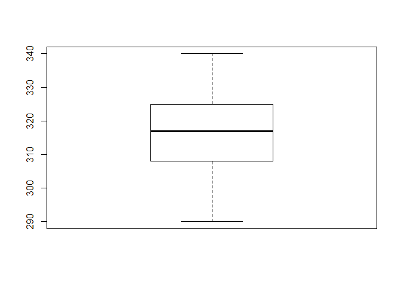<!-- -->

```r
boxplot(admissions$TOEFL.Score)#TEOFL SCORE, 0 outliers detectados
```

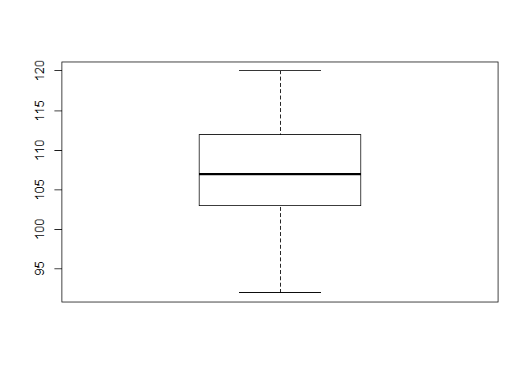<!-- -->

```r
boxplot(admissions$University.Rating)#UNIVERSITY RATING, 0 outliers detectados
```

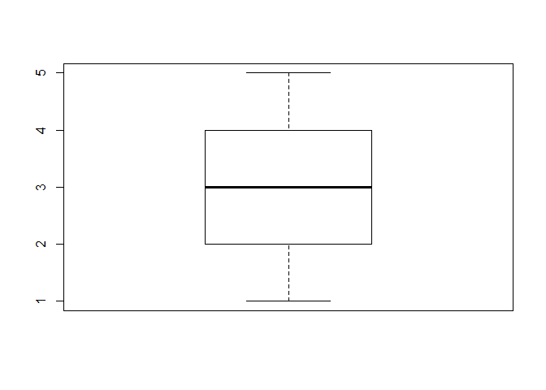<!-- -->

```r
boxplot(admissions$SOP)#SOP, 0 outliers detectados
```

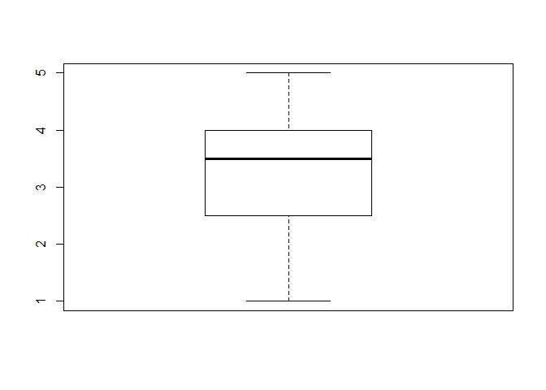<!-- -->

```r
boxplot(admissions$LOR) #LOR, se detectó 1 outlier
```

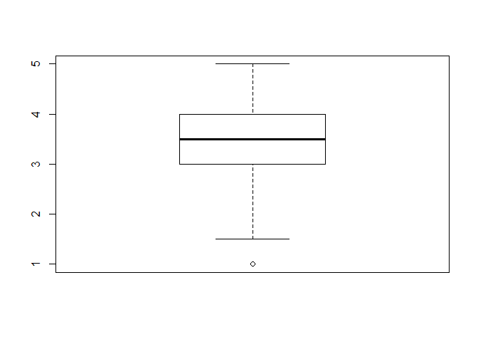<!-- -->

```r
boxplot(admissions$CGPA) #GPA, 0 outliers detectados
```

<!-- -->

```r
boxplot(admissions$Chance.of.Admit)#POSIBILIDAD DE ADMISION,Se detectaron 2 outliers
```

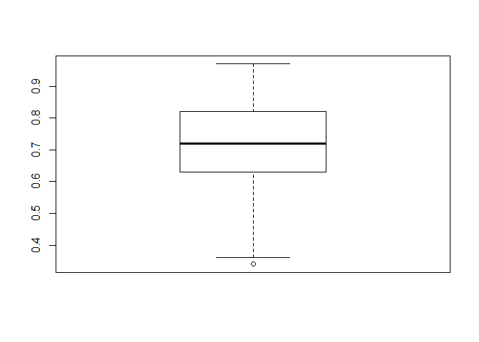<!-- -->

#### Eliminar outliers, dado a que solamente son el 0.6% de nuestra data total


```r
admissions <- admissions %>%
  filter(LOR > 1, Chance.of.Admit > 0.34)
```

#### Estudiemos la relacion entre las variables independientes(GRE,TEOFL,UNIVERSITY RANKING,SOP,LOR,CGPA,RESEARCH) y la variable dependiente (Chance of admit).

En este primer grafico veremos un resumen de las relaciones:


```r
ggpairs(admissions,progress = FALSE)
```

```
## `stat_bin()` using `bins = 30`. Pick better value with `binwidth`.
## `stat_bin()` using `bins = 30`. Pick better value with `binwidth`.
## `stat_bin()` using `bins = 30`. Pick better value with `binwidth`.
## `stat_bin()` using `bins = 30`. Pick better value with `binwidth`.
## `stat_bin()` using `bins = 30`. Pick better value with `binwidth`.
## `stat_bin()` using `bins = 30`. Pick better value with `binwidth`.
## `stat_bin()` using `bins = 30`. Pick better value with `binwidth`.
```

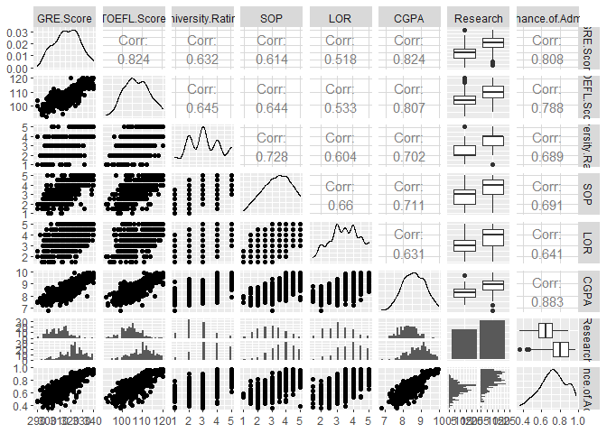<!-- -->

#### Miremos en mejor detalle abajo las relaciones lineales entre las variables continuas con la dependiente:

##### Podemos observar una relacion positiva medianamente fuerte entre las variables contiuas GRE,TOEFL,y CGPA con la variable dependiente Chance of admission (Posibilidad de admision). Con los datos disponibles entonces veemos que mientras mayor sea el GRE SCORE, mayor sera la posibilidad de ser admitido al programa de posgrado, y lo mismo ocurre con TOEFL, y CGPA.


```r
plot(admissions$GRE.Score,admissions$Chance.of.Admit) 
```

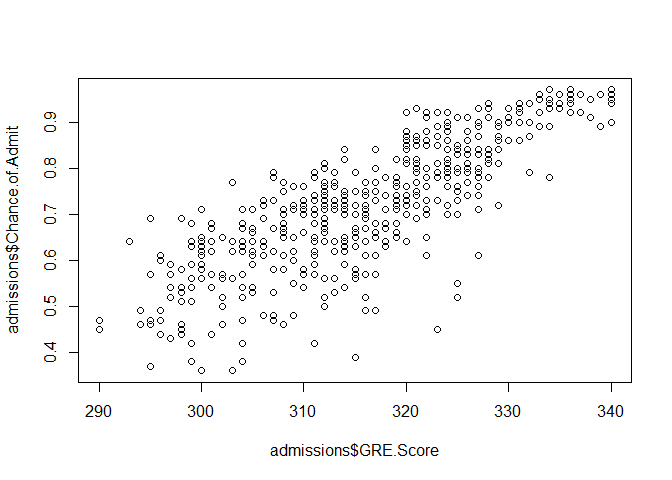<!-- -->

```r
plot(admissions$TOEFL.Score,admissions$Chance.of.Admit)
```

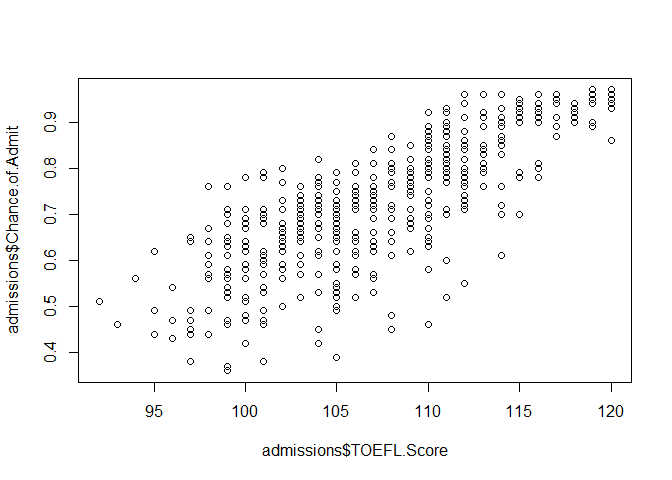<!-- -->

```r
plot(admissions$CGPA,admissions$Chance.of.Admit)
```

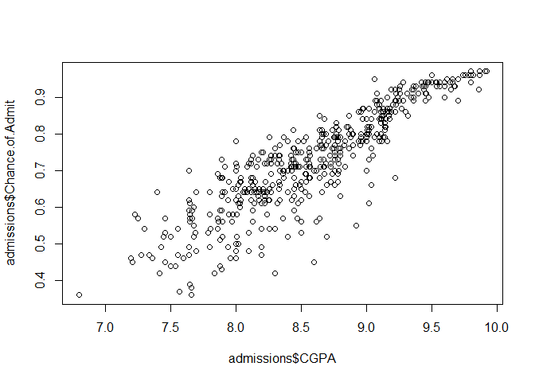<!-- -->

#### Estudiemos las variables categoricas y su relacion con la variable dependiente. El eje Y siempre siendo la variable dependiente (Posibilidad de admision).

#### Vemos que en cada instancia, mientras mayor sea el valor de las variables discretas, mayor la posibilidad de ingreso.


```r
#boxplots
plot(as.factor(admissions$University.Rating),admissions$Chance.of.Admit)#UNIVERSITY RATING
```

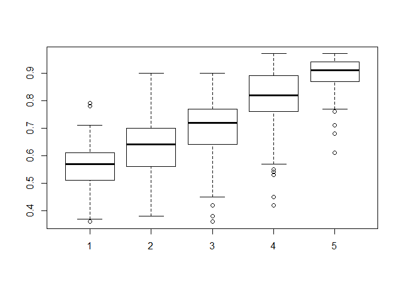<!-- -->

```r
plot(as.factor(admissions$SOP),admissions$Chance.of.Admit)#SOP
```

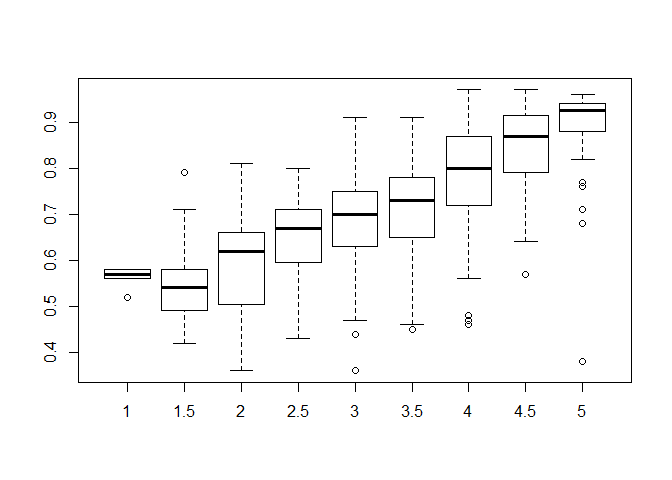<!-- -->

```r
plot(as.factor(admissions$LOR),admissions$Chance.of.Admit)#LOR
```

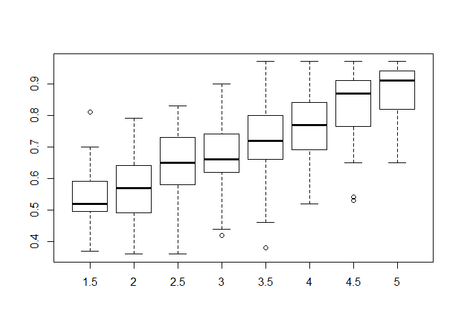<!-- -->

```r
plot(admissions$Research,admissions$Chance.of.Admit)#RESEARCH
```

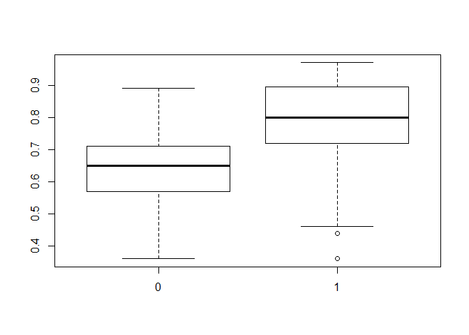<!-- -->

#### Estudiemos la correlacion entre las variables independiente y variable dependiente:

GRE,TOEFL,CGPA Correlacion fuerte entre variable dependiente y entre si mismas.

Correlacion mediana entre UNIVERSITY,SOP, y LOR con variable dependiente.


```r
cor(admissions[-7])
```

```
##                   GRE.Score TOEFL.Score University.Rating       SOP
## GRE.Score         1.0000000   0.8243602         0.6315141 0.6142865
## TOEFL.Score       0.8243602   1.0000000         0.6453490 0.6438063
## University.Rating 0.6315141   0.6453490         1.0000000 0.7275687
## SOP               0.6142865   0.6438063         0.7275687 1.0000000
## LOR               0.5184572   0.5332625         0.6038306 0.6598581
## CGPA              0.8237387   0.8072817         0.7019795 0.7111749
## Chance.of.Admit   0.8075936   0.7881283         0.6886207 0.6906537
##                         LOR      CGPA Chance.of.Admit
## GRE.Score         0.5184572 0.8237387       0.8075936
## TOEFL.Score       0.5332625 0.8072817       0.7881283
## University.Rating 0.6038306 0.7019795       0.6886207
## SOP               0.6598581 0.7111749       0.6906537
## LOR               1.0000000 0.6311882       0.6411145
## CGPA              0.6311882 1.0000000       0.8831215
## Chance.of.Admit   0.6411145 0.8831215       1.0000000
```
#### Antes de comenzar a armar los modelos, es necesario llevar a la misma escala a los datos, que tomaran un valor entre 0 y 1, manteniendo su peso. 


#### Formula: x - x minimum/x max - x min


```r
(admissions$GRE.Score -min(admissions$GRE.Score))/(max(admissions$GRE.Score) - min(admissions$GRE.Score))

normalize <- function(x){
  
  (x - min(x))/(max(x) - min(x))
  
}

normalize(admissions$GRE.Score)


admissions[c(-7,-8)] <- lapply(admissions[c(-7,-8)],function(x) normalize(x)) %>%
  bind_rows()
```


```r
head(admissions, n = 10)
```

```
##    GRE.Score TOEFL.Score University.Rating   SOP       LOR      CGPA
## 1       0.94   0.9285714              0.75 0.875 0.8571429 0.9134615
## 2       0.68   0.5357143              0.75 0.750 0.8571429 0.6634615
## 3       0.52   0.4285714              0.50 0.500 0.5714286 0.3846154
## 4       0.64   0.6428571              0.50 0.625 0.2857143 0.5993590
## 5       0.48   0.3928571              0.25 0.250 0.4285714 0.4519231
## 6       0.80   0.8214286              1.00 0.875 0.4285714 0.8141026
## 7       0.62   0.6071429              0.50 0.500 0.7142857 0.4487179
## 8       0.36   0.3214286              0.25 0.500 0.7142857 0.3525641
## 9       0.24   0.3571429              0.00 0.250 0.0000000 0.3846154
## 10      0.66   0.5714286              0.50 0.625 0.4285714 0.5769231
##    Research Chance.of.Admit
## 1         1            0.92
## 2         1            0.76
## 3         1            0.72
## 4         1            0.80
## 5         0            0.65
## 6         1            0.90
## 7         1            0.75
## 8         0            0.68
## 9         0            0.50
## 10        0            0.45
```


#### Dividamos en 3 partes al dataset. Uno para entrenar el modelo, uno para validar y comparar modelos, y el ultimo para testear la exactitud final del modelo seleccionado.


```r
names(admissions) <- c('GRE','TOEFL','UNI','SOP','LOR','CGPA','RESEARCH','ADMIT')

#train/val/test splitting
set.seed(999)
train_index <- sample(1:nrow(admissions),nrow(admissions) * 0.8)

train_set <- admissions[train_index,]

val_index <- sample(1:nrow(train_set),nrow(train_set) * .2)

val_set <- train_set[val_index,]

train_set <- train_set[-val_index,]

test_set <- admissions[-train_index,]
```

# __Parte 2:__

Comparasion entre 2 modelos, el primero lo hare con las variables independientes mas correlacionadas con la variable dependiente(chance of admit)  
El segundo modelo utilizara todas las variables.  
model_1 : variables independientes: GRE,TOEFL,CGPA  
model_2 : variables independientes - todas las variables en el dataset     


#### Modelo 1

Observemos abajo lo siguiente:  
- Las tres variables son estadisticamente significantes.  
Estimadores significantes:    
- Por cada unidad de GRE, la posibilidad de admision se incrementa en 0.10911 unidades.   
- Por cada unidad de TEOFL, la posibilidad de admision se incrementa en 0.09337 unidades.  
- Por cada unidad de CGPA, la posibilidad de admision se incrementa en 0.43329 unidades.  
- *Tengan en cuenta que estas variables estan escaladas, en la cual un aumento de 1 en CGPA , significaria un aumento de 0.43 unidades en la posidibildad de ser admitido, cuyo maximo valor es 1.*  

R2 = 0.7814.   
GRE, TEOFL y CGPA representan ~ 78% de la variabilidad de ADMIT, la variable dependiente.


```r
model_1 <- lm(ADMIT ~ GRE + TOEFL + CGPA, data=train_set)

model_1
```

```
## 
## Call:
## lm(formula = ADMIT ~ GRE + TOEFL + CGPA, data = train_set)
## 
## Coefficients:
## (Intercept)          GRE        TOEFL         CGPA  
##     0.36785      0.10911      0.09337      0.43329
```

```r
summary(model_1)
```

```
## 
## Call:
## lm(formula = ADMIT ~ GRE + TOEFL + CGPA, data = train_set)
## 
## Residuals:
##      Min       1Q   Median       3Q      Max 
## -0.29319 -0.01965  0.00829  0.03650  0.13402 
## 
## Coefficients:
##             Estimate Std. Error t value Pr(>|t|)    
## (Intercept)  0.36785    0.01145  32.135  < 2e-16 ***
## GRE          0.10911    0.03238   3.369 0.000847 ***
## TOEFL        0.09337    0.03310   2.821 0.005090 ** 
## CGPA         0.43329    0.03488  12.423  < 2e-16 ***
## ---
## Signif. codes:  0 '***' 0.001 '**' 0.01 '*' 0.05 '.' 0.1 ' ' 1
## 
## Residual standard error: 0.06434 on 314 degrees of freedom
## Multiple R-squared:  0.7834,	Adjusted R-squared:  0.7814 
## F-statistic: 378.6 on 3 and 314 DF,  p-value: < 2.2e-16
```

#### Prueba de multicolinealidad (La multicolinealidad es la relación de dependencia lineal fuerte entre más de dos variables explicativas en una regresión múltiple, su presencia puede causar un modelo ineficaz.)

No hay evidencia de la presencia de multicolinealidad excesiva. 

```r
vif(model_1)
```

```
##      GRE    TOEFL     CGPA 
## 3.933115 3.613360 3.548364
```
#### RMSE test del modelo 1 en nuestro set de validacion

#### RMSE es una medida de uso frecuente de las diferencias entre los valores predichos por un modelo o un estimador y los valores observados. Mientras menos sea el valor del RMSE, mejor habilidad predictiva tiene nuestro modelo.


```r
admit <- val_set$ADMIT

val_set$model_1 <- predict(model_1,newdata=val_set)

(rmse_model_1 <- sqrt(mean((admit - val_set$model_1)^2)))
```

```
## [1] 0.06575011
```

```r
#RMSE = 0.06575011
#R2 = 0.7814
```


#### Grafico modelo 1

```r
ggplot(val_set,aes(x = model_1, y = ADMIT))+
  geom_point()+
  geom_smooth(method = 'lm',se = F)
```

```
## `geom_smooth()` using formula 'y ~ x'
```

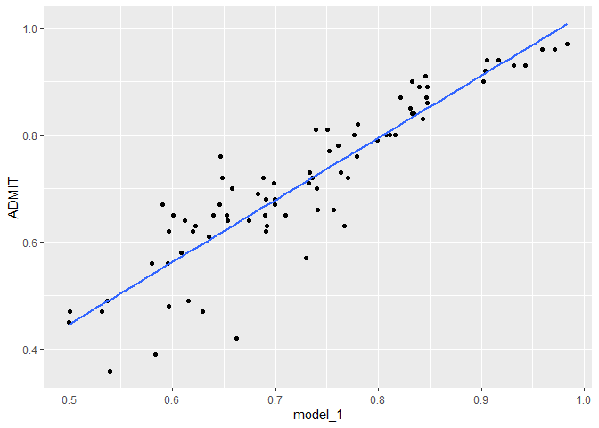<!-- -->

#### Modelo 2, utilizando todas las variables

Observaciones:  
-UNI, Y SOP no son significantes.  
Estimadores significantes(por cada unidad de estas variables, sube en * unidades la variable dependiente:  
-GRE = 0.078876*    
-CGPA = 0.395942*  
-LOR = 0.055364*  
-RESEARCH = 0.025020*  
-TOEFL = 0.074931*

R2 = 0.7953 
Las variables presentes en este modelo representan ~ 80% de la variabilidad de ADMIT, la variable dependiente.  

El R2 en este modelo mejoró.


```r
names(admissions)
```

```
## [1] "GRE"      "TOEFL"    "UNI"      "SOP"      "LOR"      "CGPA"    
## [7] "RESEARCH" "ADMIT"
```

```r
model_2 <- lm(ADMIT ~ GRE + TOEFL + CGPA + UNI + SOP + LOR + RESEARCH,data=train_set)

model_2
```

```
## 
## Call:
## lm(formula = ADMIT ~ GRE + TOEFL + CGPA + UNI + SOP + LOR + RESEARCH, 
##     data = train_set)
## 
## Coefficients:
## (Intercept)          GRE        TOEFL         CGPA          UNI  
##     0.36764      0.08884      0.07493      0.35724      0.02272  
##         SOP          LOR    RESEARCH1  
##     0.01570      0.05362      0.02203
```

```r
summary(model_2)
```

```
## 
## Call:
## lm(formula = ADMIT ~ GRE + TOEFL + CGPA + UNI + SOP + LOR + RESEARCH, 
##     data = train_set)
## 
## Residuals:
##      Min       1Q   Median       3Q      Max 
## -0.26934 -0.02163  0.00904  0.03550  0.14976 
## 
## Coefficients:
##             Estimate Std. Error t value Pr(>|t|)    
## (Intercept) 0.367637   0.011522  31.908  < 2e-16 ***
## GRE         0.088838   0.032927   2.698  0.00736 ** 
## TOEFL       0.074931   0.032723   2.290  0.02270 *  
## CGPA        0.357238   0.038461   9.288  < 2e-16 ***
## UNI         0.022724   0.019825   1.146  0.25259    
## SOP         0.015703   0.023263   0.675  0.50017    
## LOR         0.053622   0.018613   2.881  0.00424 ** 
## RESEARCH1   0.022026   0.008455   2.605  0.00963 ** 
## ---
## Signif. codes:  0 '***' 0.001 '**' 0.01 '*' 0.05 '.' 0.1 ' ' 1
## 
## Residual standard error: 0.06225 on 310 degrees of freedom
## Multiple R-squared:  0.7998,	Adjusted R-squared:  0.7953 
## F-statistic:   177 on 7 and 310 DF,  p-value: < 2.2e-16
```
#### No hay evidencia de multicolinealidad


```r
vif(model_2)
```

```
##       GRE     TOEFL      CGPA       UNI       SOP       LOR RESEARCH1 
##  4.343958  3.772971  4.609131  2.701335  2.785868  2.019547  1.440971
```


#### Estudiemos la posibilidad de eliminar variables que no aporten a nuestro modelo. Realizaremos un test anova en distintos escenario con distintos modelos.  

##### Al hacer un test anova con modelos sin las variables TEOFL,SOP, ni UNIVERISTY RATING(UNI), vemos que el test anova nos retorna un valor significante, que significa que esas tres variable juntas SI aportan a nuestro modelo. Sin embargo, el mismo test con el modelo sin la variable SOP, nos dice que esta variable realmente no nos contribuye en nada. Mas abajo vemos que incluso al eliminar la variable SOP, nuestro R2 mejora.

```r
model_drop_uni_sop_teo <- lm(ADMIT ~ GRE + CGPA + LOR + RESEARCH,data = train_set)

model_drop_uni <- lm(ADMIT ~ GRE + TOEFL + CGPA  + SOP + LOR + RESEARCH,data=train_set)

model_drop_sop <- lm(ADMIT ~ GRE + TOEFL + CGPA + UNI + LOR + RESEARCH,data=train_set)

model_drop_teo <- lm(ADMIT ~ GRE  + CGPA + UNI + SOP + LOR + RESEARCH,data=train_set)

model_drop_uni_teo <- lm(ADMIT ~ GRE + CGPA + SOP + LOR + RESEARCH,data=train_set)

anova(model_drop_uni_sop_teo,model_2)
```

```
## Analysis of Variance Table
## 
## Model 1: ADMIT ~ GRE + CGPA + LOR + RESEARCH
## Model 2: ADMIT ~ GRE + TOEFL + CGPA + UNI + SOP + LOR + RESEARCH
##   Res.Df    RSS Df Sum of Sq      F Pr(>F)  
## 1    313 1.2391                             
## 2    310 1.2013  3  0.037797 3.2512 0.0221 *
## ---
## Signif. codes:  0 '***' 0.001 '**' 0.01 '*' 0.05 '.' 0.1 ' ' 1
```

```r
#TEOFL,UNI and SOP agregan valor significante al modelo, mantenerlos.

anova(model_drop_uni,model_2)#p-value insignificante 0.2526
```

```
## Analysis of Variance Table
## 
## Model 1: ADMIT ~ GRE + TOEFL + CGPA + SOP + LOR + RESEARCH
## Model 2: ADMIT ~ GRE + TOEFL + CGPA + UNI + SOP + LOR + RESEARCH
##   Res.Df    RSS Df Sum of Sq      F Pr(>F)
## 1    311 1.2064                           
## 2    310 1.2013  1 0.0050913 1.3138 0.2526
```

```r
anova(model_drop_sop,model_2)#p-value insignificante 0.5002
```

```
## Analysis of Variance Table
## 
## Model 1: ADMIT ~ GRE + TOEFL + CGPA + UNI + LOR + RESEARCH
## Model 2: ADMIT ~ GRE + TOEFL + CGPA + UNI + SOP + LOR + RESEARCH
##   Res.Df    RSS Df Sum of Sq      F Pr(>F)
## 1    311 1.2031                           
## 2    310 1.2013  1 0.0017657 0.4556 0.5002
```

```r
anova(model_drop_teo,model_2)#p-value significante 0.0227
```

```
## Analysis of Variance Table
## 
## Model 1: ADMIT ~ GRE + CGPA + UNI + SOP + LOR + RESEARCH
## Model 2: ADMIT ~ GRE + TOEFL + CGPA + UNI + SOP + LOR + RESEARCH
##   Res.Df    RSS Df Sum of Sq      F Pr(>F)  
## 1    311 1.2216                             
## 2    310 1.2013  1   0.02032 5.2435 0.0227 *
## ---
## Signif. codes:  0 '***' 0.001 '**' 0.01 '*' 0.05 '.' 0.1 ' ' 1
```

```r
anova(model_drop_uni_teo,model_2)# p-value significante, eliminar uni y teo afectaria al modelo
```

```
## Analysis of Variance Table
## 
## Model 1: ADMIT ~ GRE + CGPA + SOP + LOR + RESEARCH
## Model 2: ADMIT ~ GRE + TOEFL + CGPA + UNI + SOP + LOR + RESEARCH
##   Res.Df    RSS Df Sum of Sq      F  Pr(>F)  
## 1    312 1.2285                              
## 2    310 1.2013  2  0.027224 3.5126 0.03101 *
## ---
## Signif. codes:  0 '***' 0.001 '**' 0.01 '*' 0.05 '.' 0.1 ' ' 1
```

```r
#Drop la variable SOP
```
#### Modelo 2 sin SOP tiene un R2 = 0.7957, un poco mejor que antes.

```r
summary(model_drop_sop)
```

```
## 
## Call:
## lm(formula = ADMIT ~ GRE + TOEFL + CGPA + UNI + LOR + RESEARCH, 
##     data = train_set)
## 
## Residuals:
##       Min        1Q    Median        3Q       Max 
## -0.268018 -0.020980  0.009876  0.034511  0.149447 
## 
## Coefficients:
##             Estimate Std. Error t value Pr(>|t|)    
## (Intercept) 0.369010   0.011331  32.566  < 2e-16 ***
## GRE         0.087407   0.032830   2.662  0.00816 ** 
## TOEFL       0.077846   0.032408   2.402  0.01689 *  
## CGPA        0.360717   0.038081   9.472  < 2e-16 ***
## UNI         0.027833   0.018308   1.520  0.12946    
## LOR         0.057898   0.017486   3.311  0.00104 ** 
## RESEARCH1   0.022142   0.008446   2.622  0.00918 ** 
## ---
## Signif. codes:  0 '***' 0.001 '**' 0.01 '*' 0.05 '.' 0.1 ' ' 1
## 
## Residual standard error: 0.0622 on 311 degrees of freedom
## Multiple R-squared:  0.7996,	Adjusted R-squared:  0.7957 
## F-statistic: 206.8 on 6 and 311 DF,  p-value: < 2.2e-16
```

```r
model_2_final <- model_drop_sop
```
#### RMSE test del modelo 2 en nuestro set de validacion

```r
val_set$model_2 <- predict(model_2_final,newdata=val_set)

(RMSE_model_2 <- sqrt(mean((admit - val_set$model_2)^2)))
```

```
## [1] 0.0610645
```

```r
#RMSE = 0.0610645
#R2 = 0.7957
```

#### El segundo modelo nos dio un RMSE menor al modelo 1, como tambien un R2 mejor.  
#### El segundo modelo entonces es mejor con un RMSE de 0.0610645 y un R2 de 0.7957.

#### Apliquemos el modelo entonces a nuestra test data, que en este analisis representaria data nunca antes vista y nos daria una idea de como se comportaria en "el mundo real":


```r
test_set$model_2 <- predict(model_2_final,newdata=test_set)

(rmse_model_2_test <- sqrt(mean((test_set$ADMIT - test_set$model_2)^2)))
```

```
## [1] 0.04547105
```

#### Un RMSE de 0.04547105, impecable! 


```r
ggplot(test_set,aes(x = model_2, y = ADMIT))+
  geom_point()+
  geom_smooth(method = 'lm', se = F)
```

```
## `geom_smooth()` using formula 'y ~ x'
```

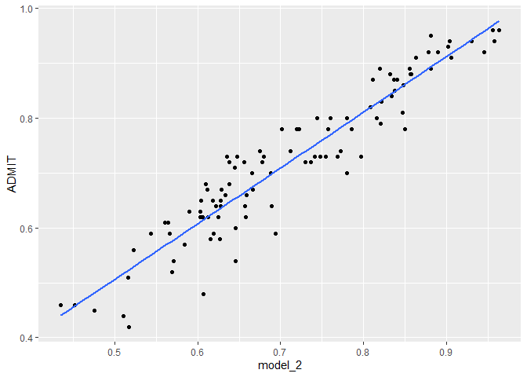<!-- -->


